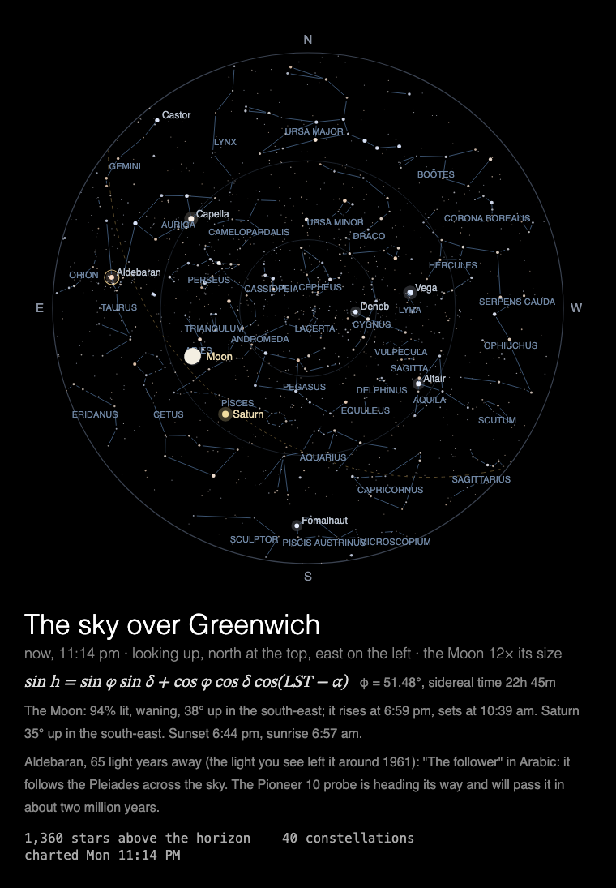

# MMM-NightSky

A [MagicMirror²](https://magicmirror.builders/) module that charts tonight's sky over the mirror: stars, constellations, planets and the Moon in its phase.



**The sky over the mirror, tonight.** The whole sky as a circle, overhead at the centre, the
horizon at the rim: 2,855 stars sized by brightness and coloured by temperature, the 88
constellation figures drawn in one by one, the planets where they are, and the Moon in its
phase, lit from the Sun's side. By day, tonight's sky as soon as it's dark. Underneath: the
Moon's and planets' risings, sunset, a named full moon, and one star's story.

Built for a **Raspberry Pi 3 without GPU acceleration**: everything is drawn by the CPU, so the
drawing is designed around what that costs (see [Performance](#performance)), and the animation
stops completely while the module is hidden.

## Installation

```bash
cd ~/MagicMirror/modules
git clone https://github.com/charleswest775/MMM-NightSky
```

No npm dependencies: there is nothing to install.

## Update

```bash
cd ~/MagicMirror/modules/MMM-NightSky
git pull
```

## Configuration

```js
{
	module: "MMM-NightSky",
	position: "middle_center",
	config: {
		skyLatitude: 51.5074,   // London
		skyLongitude: -0.1278,
		skyPlace: "London",
		width: 700,
		height: 700,
		fps: 12
	}
},
```

The times in the caption (sunset and sunrise, the Moon's rising and setting, "now, 11:14 pm") are in the display's own
time zone, the clock of the computer running MagicMirror², so set its time zone to the place's.

| Option | Default | Description |
|---|---|---|
| `skyLatitude`, `skyLongitude` | `51.4769`, `-0.0005` (Greenwich) | Where the mirror is, in degrees, north and east positive |
| `skyPlace` | `"Greenwich"` | Its name, for the title: "The sky over London". Without it, anywhere but Greenwich is named by its latitude, e.g. "51.5° N" |
| `cycleSeconds` | `600` | A fresh chart each time the module is shown, or this often while it stays shown |
| `width`, `height` | `700` | Canvas size in pixels |
| `fps` | `12` | Frame-rate cap |
| `showMath` | `true` | Title, equation, facts, the star's story and live numbers under the canvas |
| `turns` | `null` | Take turns with other modules on the same page, e.g. `{ of: 2, at: 1 }`: see [Taking turns](#taking-turns) |
| `statsPanel` | `false` | A line under the caption showing what the mirror spends: fps, CPU of Electron and the compositor, a bar per core, temperature. Sampled by the module's `node_helper` from `/proc`, only while the module is shown |
| `debugStats` | `false` | Show achieved fps and per-frame timings in the corner of the screen |

## Taking turns

With [MMM-pages](https://github.com/edward-shen/MMM-pages), every page added makes the rotation
longer. Modules on the same page can share it instead: with `turns: { of: n, at: k }`, each of
n modules shows on its own one in n showings of the page, the first on showing 0, the next on
showing 1, and so on. A module not on its turn takes no room on the page and costs nothing.
The sky has a page of its own on the mirror, so it doesn't use this; for an example, see
[MMM-SacredGeometry](https://github.com/charleswest775/MMM-SacredGeometry),
[MMM-Tilings](https://github.com/charleswest775/MMM-Tilings) and
[MMM-PlanetsDance](https://github.com/charleswest775/MMM-PlanetsDance), which share a page and
take turns in threes.

On a page of its own, leave `turns` out. The module works just as well in a normal region
without MMM-pages, where it is never hidden and charts the sky afresh every `cycleSeconds`.

## What's on the chart

The whole sky as a circle, as seen lying on your back with your head to the north: the point
overhead at the centre, the horizon at the rim, north at the top and east on the left, in a
stereographic projection, which keeps the constellations' shapes. After dark it charts the sky
at that moment; by day, tonight's, when the Sun is 12° down. (Where the Sun doesn't get that far
down, as on summer nights north of about 54°, it charts the sky at the moment it is shown.)

The stars appear, brightest first, sized by magnitude and coloured by their B − V temperature;
the constellation figures are drawn in one by one from east to west; then the names, the
ecliptic (dashed), the planets, and the Moon, enlarged 12 times, in its phase, its lit side
turned along the sky towards the Sun. It holds after about 17 s. Underneath: the Moon's phase,
height and rising and setting, the planets that are up, sunset and sunrise, the Harvest or
Hunter's Moon when there is one, and the story of one star that is well up (27 of them, a
deck): what its name means, what's odd about it, and, when its distance is known well enough,
when the light you see left it.

## The astronomy

The astronomy follows Meeus's *Astronomical Algorithms* (`simulations/sky-math.js`): sidereal
time, rigorous precession from J2000 to the date, the Moon from the main terms of ELP-2000/82,
parallax and refraction, the Moon's phase and bright limb, planets' magnitudes; the Sun and
planets from JPL's approximate Keplerian elements (`simulations/ephemeris.js`, Standish). The
tests check it against Meeus's worked examples (sidereal time for 1987 April 10, the Sun for
1992 October 13 to 0.01°, the Moon for 1992 April 12 to 0.0005° and 1 km) and the eclipses of
2026 (new and full moons within 3 minutes), plus the projection, precession's 1.397° a century,
star colours, the star data, and the choice between tonight and now.

Stars and figures come from [d3-celestial](https://github.com/ofrohn/d3-celestial) by Olaf
Frohn (BSD 3-Clause; its stars from XHIP, names from the VizieR cross-indexes, figures after the
IAU's charts): `node tools/build-stars.js <its data folder>` keeps the 2,855 stars to magnitude
5.5 (and Mira, a variable, as a faint point where the figure of Cetus needs it), their IAU
names, and the 88 figures as pairs of stars, in `data/stars.js`, with d3-celestial's licence.
The stories, in `data/star-stories.js`, were written for this module.

## Performance

Computed once per showing (~7 ms on a Mac), drawn in stages: the stars' 3 s change most of the
chart each frame, the figures' 12 s only where each is drawn (27% of the canvas on average over
the drawing), then the module rests.

Measured on a Raspberry Pi 3 B+ (Electron 42, software rendering, 700×700 at 12 fps, seven
showings, CPU of the Electron processes plus the `cage` compositor, in % of one core; the Pi has
four, and the mirror without the module uses 0.2%):

| | % of one core | achieved fps |
|---|---|---|
| while the chart is drawn | ~17 | 11 |
| the finished chart held (stats panel on) | ~5 | 0 |
| over a 30 s showing, its page change and the stars' first seconds included (~112 for the first 3 s; drawn by ~19 s) | 23 (22–24) | 11 |

The cheapest of the family's drawing pages: once drawn, it costs less than a page of
crossfading photos.

What costs what on the Pi:

- There is no GPU acceleration to be had (the Pi 3's GPU does only GLES 2.0), so all canvas
  drawing is done by the CPU.
- Any frame that changes the canvas costs ~2% of a core per fps, before drawing anything; hence
  the 12 fps cap.
- On top of that, cost grows with the **area that changes**: Chromium redraws the bounding box
  of everything touched in a frame. So each frame draws only what is new, and the figures are
  drawn one at a time.
- JavaScript is not the bottleneck: the chart is computed once per showing, and step and draw
  take a few milliseconds per frame.
- The frame loop sleeps with `setTimeout` until a frame is due. Once the chart is finished the
  module rests, and is only polled twice a second. While MagicMirror fades the module out,
  nothing new is drawn, and once it is hidden (another MMM-pages page, say) the loop stops
  completely: measured with the same loop in MMM-ChaosTheory, 0.3% of a core against the
  mirror's 0.2% without it.

## Development

```bash
node --test                    # the astronomy against Meeus and the 2026 eclipses (no dependencies)
python3 -m http.server         # in the module folder, then open http://localhost:8000/dev/preview.html
node tools/build-stars.js DIR  # rebuild data/stars.js from d3-celestial's data folder
```

`tools/build-stars.js` reads `stars.6.json`, `starnames.json`, `constellations.json` and
`constellations.lines.json` from d3-celestial's `data` folder; they are not kept here.

`dev/preview.html` runs the module outside MagicMirror², in a portrait 1200×1920 frame, with
hide/show buttons that follow MagicMirror's suspend/resume order. Query options override the
config, e.g. `?skyLatitude=51.5074&skyLongitude=-0.1278&skyPlace=London`, `?now=2026-09-26T21:00:00Z`
(chart another moment: that evening's full moon is the Harvest Moon) or `?statsPanel=true` (with
made-up numbers, as there is no `node_helper` in the preview). Times in the caption follow the
browser's time zone.

## License

MIT. Stars and constellation figures from [d3-celestial](https://github.com/ofrohn/d3-celestial),
Copyright (c) 2015 Olaf Frohn, BSD 3-Clause (its licence is kept in `data/stars.js`); its stars
from XHIP (Anderson & Francis 2012). Planetary positions from JPL's *Keplerian Elements for
Approximate Positions of the Major Planets* by E. M. Standish; the Sun, Moon and sidereal time
after Jean Meeus's *Astronomical Algorithms*.

Part of a family: [MMM-ChaosTheory](https://github.com/charleswest775/MMM-ChaosTheory),
[MMM-Atom](https://github.com/charleswest775/MMM-Atom),
[MMM-FractalZoom](https://github.com/charleswest775/MMM-FractalZoom),
[MMM-Chladni](https://github.com/charleswest775/MMM-Chladni),
[MMM-SacredGeometry](https://github.com/charleswest775/MMM-SacredGeometry),
[MMM-Tilings](https://github.com/charleswest775/MMM-Tilings),
[MMM-PlanetsDance](https://github.com/charleswest775/MMM-PlanetsDance),
[MMM-SnowCrystal](https://github.com/charleswest775/MMM-SnowCrystal) and
[MMM-PhotoDeck](https://github.com/charleswest775/MMM-PhotoDeck).
